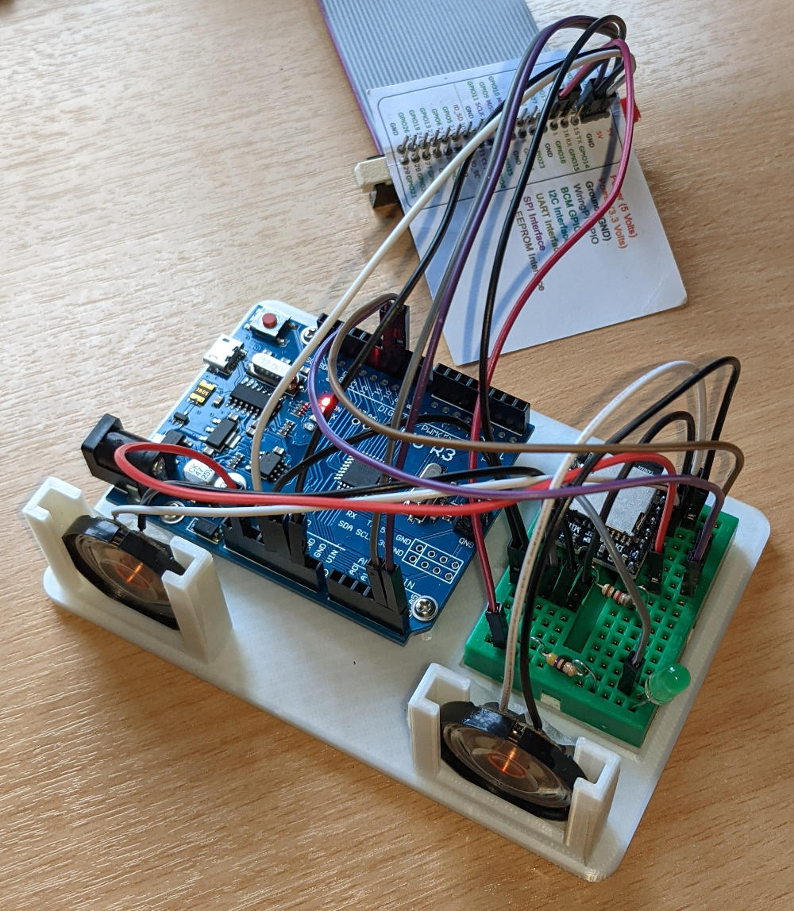

# Raspberry Pi & Arduino UNO controlled MP3 player
 Proof of concept test rig plus Python + Arduino IDE code to develop an MP3 player controlled by a master Raspberry Pi sending 'commands' to a UNO that manages a DFPlayer MP3 module.

 Further details about the project are published at <a href="https://onlinedevices.co.uk/Pi-UNO+MP3+player+project" target="_blank" >this link</a> and the design for the custom 3D printed test rig 'frame' can be downloaded from <a href="https://www.prusaprinters.org/prints/121007-raspberry-pi-uno-mp3-player-test-rig" target="_blank">here</a>.

 &nbsp; &nbsp; 
 

